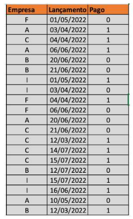
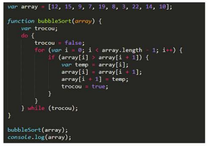

# 1. Empresa ABC

A empresa ABC tem o interesse de automatizar o processo de licenciamento de bebidas com teor alcoólico acima de 90%.

Neste processo, o solicitante que necessita desta licença para vender este tipo de produto, preenche um formulário em papel e entrega seu pedido junto ao protocolo do Ministério, que por sua vez encaminha esta demanda para a Coordenação de Destilados (CDEST).

Nesta área, o Chefe da unidade distribui a demanda entre os analistas na qual uma parte do time faz a análise documental e a outra parte faz a análise de mérito, em paralelo. Uma vez finalizadas as análises, o processo retorna à Chefia que emite ou não o certificado para o solicitante. Independentemente do resultado, a resposta da Chefia é enviada ao protocolo que informa ao solicitante que a demanda foi concluída e respectivo resultado, ou seja, se o pedido foi deferido ou indeferido. Em caso de deferimento, o requerente vai até o protocolo buscar a licença. Em caso de indeferimento, o solicitante é apenas informado e não pode entrar com nenhum tipo de recurso contra a decisão.

Tendo em vista a eficiência do processo por meio de redução de gastos, a Empresa ABC pretende digitalizar este serviço.

Nesta questão, espera-se que você elabore um desenho do processo descrito acima pensando em uma perspectiva de execução por meio de um sistema informatizado. Utilize notação BPMN.

<strong>Resolução<a href="imagens/diagram.svg"> aqui</a>.</strong>

# 2. Ranking de pagadores 

A consultoria PLANNING foi contratada pela Empresa PAGUE para construir um modelo que calculasse o ranking de bons pagadores on-line.
Para isso, disponibilizou a tabela de status dos pagamentos previstos por empresa (1 - Pagou; 0 - Não pagou).

Dado o enunciado em questão, crie um bloco de código em JavaScript ou em Java que calcule a média de pagamentos por empresa
e publique o ranking das empresas.

<strong>Acesse o código <a href="https://github.com/danicoln/insideworks/blob/main/rankingPagadores/appMain.java">aqui</a>.</strong>

<h3>Tabela de Lançamentos</h3>

# 3. Consumo médio de energia elétrica

A empresa XPTO tem registrado numa tabela "consumo", os consumos mensais de energia elétrica dos anos 2010-2019.
Cada linha representa um ano e cada coluna um mês. Considerando esses dados, fazer um algoritimo que imprima:

<ol>
  <li>O consumo médio em cada um dos meses destes dez anos;</li>
  <li>O mês/ano em que a empresa gastou mais energia nestes dez anos.</li>
</ol>

Nesta questão, espera-se que você escreva um bloco de código, em JavaScript ou em Java, que represente um encadeamento lógico
que execute a rotina indicada no enunciado.

<strong>Acesse o código <a href="https://github.com/danicoln/insideworks/blob/main/empresaXPTO/ConsumoMain.java">aqui</a>.</strong>

<h3>Siga o exemplo abaixo</h3>

# 4. Cadastro Nacional de Veículos

Desenhe um modelo de dados para o cadastro nacional de veículos. Sabe-se que:

<ol>
  <li>O veículo possui sempre uma placa única em todo o país, além de um número de chassi e cidade/estado de vinculação;</li>
  <li>O veículo possui sempre um responsável legal por ele. É necessário manter o histório desta responsabilidade (propriedade).</li>
  <li>O veículo pertence sempre a uma categoria;</li>
  <li>O veículo é sempre de uma marca e de um modelo e possui ano de fabricação;</li>
  <li>Um representante legal pode possuir mais de um veículo.</li>
</ol>

Nesta questão, espera-se que você desenhe um modelo relacional que atenda aos requisitos indicados no enunciado. Anexo a esta prova, está disponível uma cartilha indicando notação UML.

<strong>Acesse o diagrama <a href="imagens/diagrama_veiculos.png">aqui</a>.</strong>

# 5. Query SQL

Com base no modelo de dados da questão anterior, escreva uma query SQL que retorne as placas, cidade e estado de todos os veículos que estão cadastrados e cujo responsável legal chama-se Joaquim Silva.

<strong>Resposta:</strong>

<pre>
  SELECT dadosVeiculo.placa, dadosVeiculo.cidade, dadosVeiculo.estado 
  FROM veiculos 
  WHERE responsavel = 'Joaquim Silva';
</pre>

# Contato

<strong>* Daniel Lincoln M F Silva.</strong>

